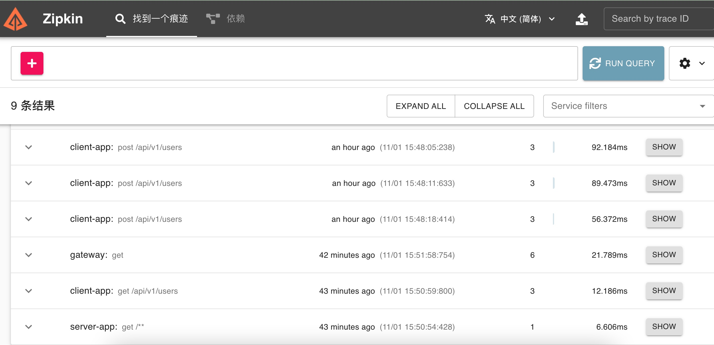

# springcloud 基于 sleuth 和 zipkin 的链路追踪

> 使用 Sleuth 生成追踪日志，并且上传到 zipkin 服务，然后通过 zipkin UI 来渲染追踪视图

## sleuth 介绍

> https://docs.spring.io/spring-cloud-sleuth/docs/current/reference/html/

Spring Cloud Sleuth 提供分布式服务的链路调用追踪。

Sleuth 从客户发起请求时开始记录，到收到响应结束。这个过程称为一个 Trace.

每个 Trace 中可能会调用多个服务，其中的每个服务调用记录称为一个 Span。若干个 Span 组成了一个 Trace。

Sleuth 会扫描 @RestController 和 @RequestMapping 注解来记录请求。

使用 @NewSpan 定义一个新的 Span。使用 @SpanName 定义 Span 的名称。

## zipkin 介绍

> https://zipkin.io/

Zipkin 是一个分布式追踪系统，提供了链路追踪的 UI 界面和依赖视图。

- 链路追踪视图


- 服务依赖视图


## 启动服务

- 启动 eureka

- 启动 gateway

- 启动 server-app

- 启动 client-app

- 部署 zipkin

```sh
docker run -d -p 9411:9411 openzipkin/zipkin
```


## 添加数据

```sh
curl -X POST http://localhost:8080/server-app/api/users?id=1&name=zhangsan
curl -X POST http://localhost:8080/server-app/api/users?id=2&name=lisi
curl -X POST http://localhost:8080/server-app/api/users?id=3&name=wangwu
```

## 查询数据

```sh
curl http://localhost:8080/client-app/api/v1/users
```

## 查看追踪视图

